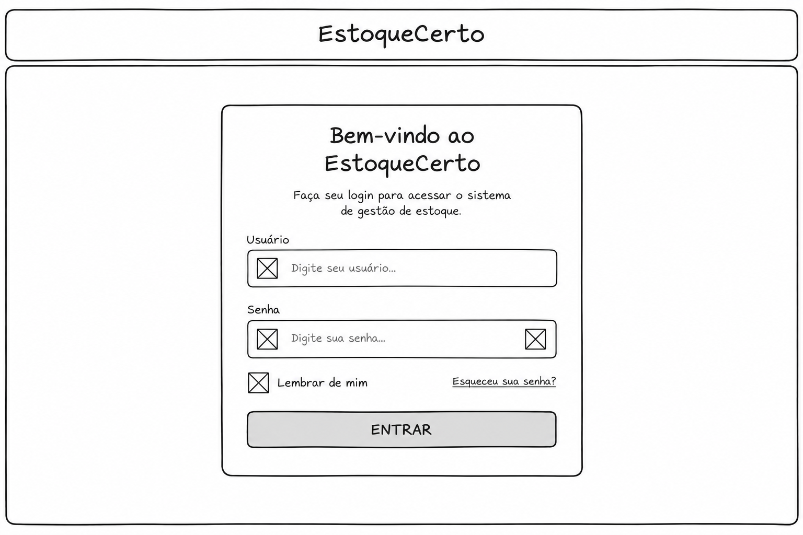
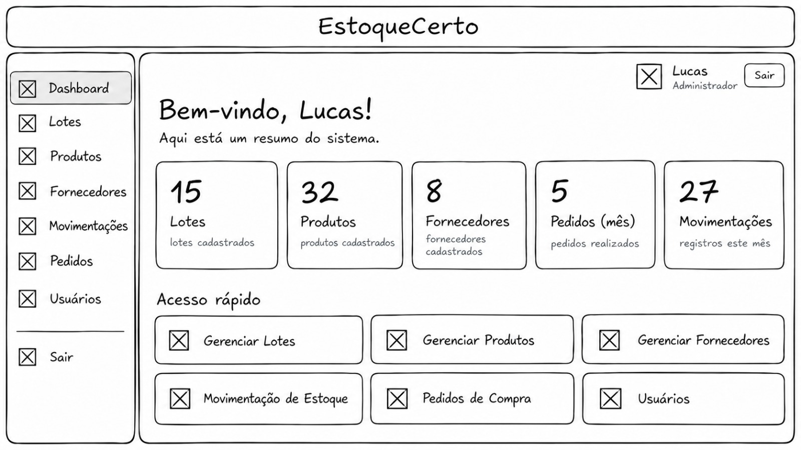
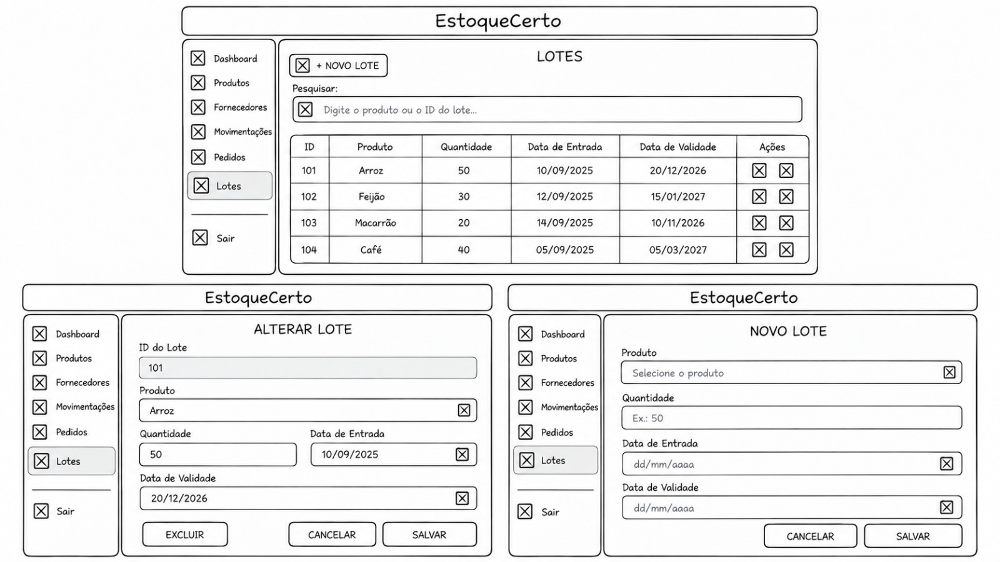
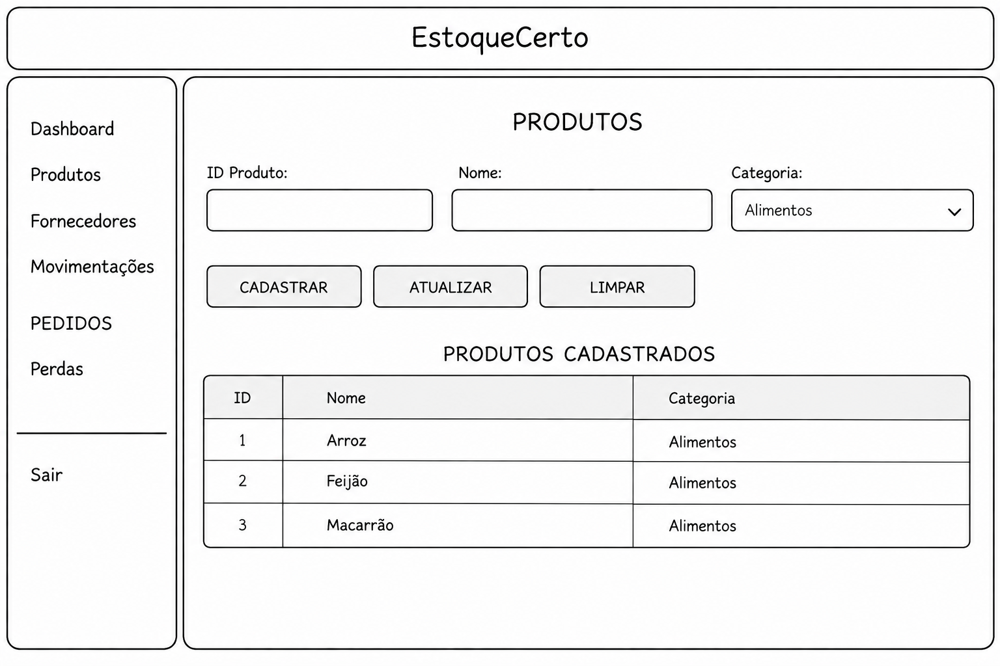
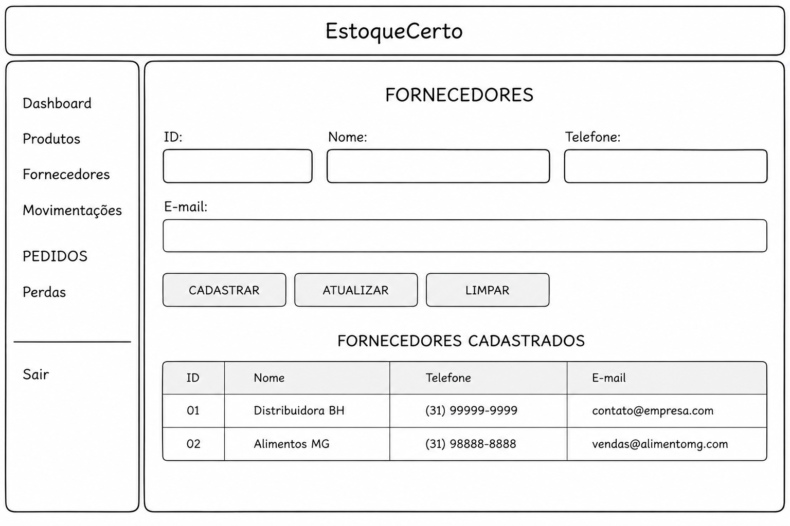
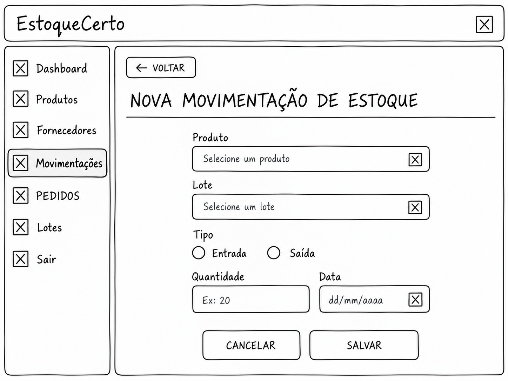
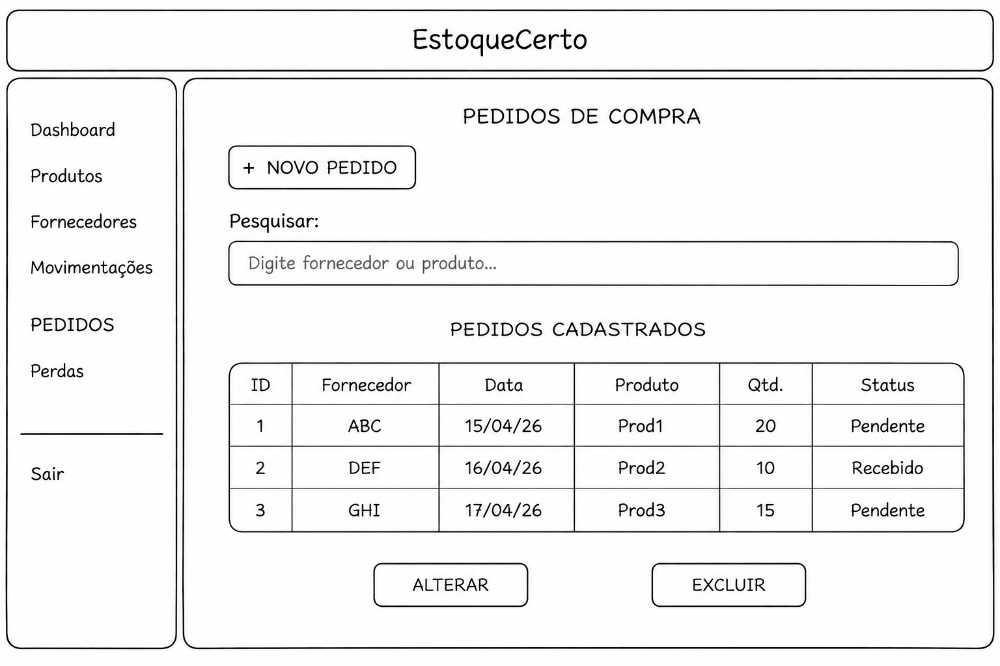
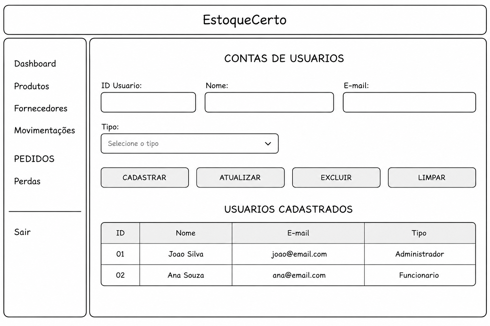
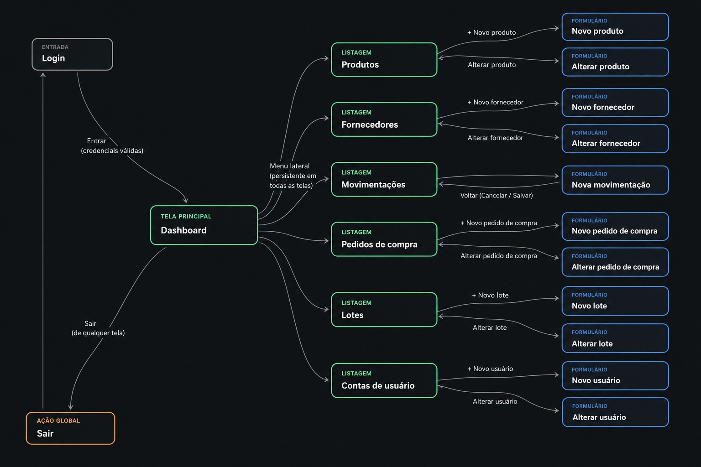

# Introdução

Informações básicas do projeto.

* **Projeto:** EstoqueCerto - Sistema de Controle Inteligente de Estoque e Validade
* **Repositório GitHub:** https://github.com/ICEI-PUC-Minas-PBR-ADS/TIAW-EstoqueCerto
* **Membros da equipe:** 

  * [César Ribeiro](https://github.com/cesarrdm2004)
  * [Bernardo Almeida](https://github.com/Bxrnardo7)
  * [Ramon Ferreira](https://github.com/RamonFerreira26)
  * [João Vitor](https://github.com/devjoaovitorrocha)
  * [Lucas Antônio](https://github.com/LC-sam0)
  * [Jéssica Naiara](https://github.com/Jesc4)

A documentação do projeto é estruturada da seguinte forma:

1. Introdução
2. Contexto
3. Product Discovery
4. Product Design (**A entrega da fase de Concepção finaliza aqui**)
5. Metodologia
6. Solução
7. Referências Bibliográficas

✅ [Documentação de Design Thinking (MIRO)](files/processo-dt.pdf)

# Contexto

Detalhes sobre o espaço de problema, os objetivos do projeto, sua justificativa e público-alvo.

## Problema

Em estoque de empresas que trabalham com produtos que possuem lote e data de validade, pode ser difícil acompanhar todos de forma manual. Com isso, alguns produtos podem acabar vencendo antes de serem usados, causando desperdícios e prejuízos.

Outro problema é a necessidade de conferir os rótulos e as datas dos produtos manualmente, além da dificuldade de saber quais lotes devem ser utilizados primeiros. Também existe o risco de um lote reprovado ser movimentado por engano e de serem feitas compras maiores do que o necessário.

Esse problema envolve principalmente os responsáveis pelo almoxarifado e estoque, o setor de compras, controle de qualidade, PCP e financeiro. Durante o levantamento do grupo, também foram indeitificadas dúvidas sobre como o estoque é controlado atualmente, como são feitas as compras e como são tratados os produtos vencidos.

Por isso, o principal problema é a dificuldade de controlar os produtos e seus lotes de forma simples e organizada, principalmente em relação à validade, movimentação e quantidade disponível.

## Objetivos

**OBJETIVO GERAL**

Criar um sistema para facilitar o controle de estoque, principalmente de produtos que possuem lote e data de validade. A ideia é ajudar no acompanhamento dos produtos, das movimentações e necessidades de compra, procurando diminuir desperdícios e melhorar o uso dos materiais.

**OBJETIVOS ESPECÍFICOS**
* Facilitar a identificação de produtos e lotes que estão perto do vencimento.
* Ajudar no uso do método FEFO (First Expired, First Out), priorizando os produtos que vão vencer primeiro.
* Melhorar o controle de produtos, lotes, fornecedores, movimentações e pedidos de compra.
* Evitar que lotes suspeitos ou reprovados sejam movimentados por engano.
* Ajudar o setor de compras a identificar quando é necessário repor o estoque.
* Evitar compras maiores do que o necessário.
* Apresentar informações que possam ajudar o PCP no planejamento da produção.
* Permitir o acompanhamento das perdas e dos impactos causados pelos descartes.

Esses objetivos seguem a proposta do grupo de criar uma solução que ajude no controle das validades, na organização dos lotes e nas movimentações do estoque, além de dar suporte aos setores de compras, PCP, qualidade e financeiro.

## Justificativa

O controle de estoque é importante para as empresas que trabalham com materiais que possuem data de validade. Quando esse controle não é feito da forma certa, alguns produtos podem vencer antes de serem usados, gerando desperdícios e gastos.

A ideia do projeto surgiu para facilitar esse controle e diminuir a necessidade de conferir tantos processos manualmente. Com o nosso sistema, seria possível visualizar melhor os produtos e lotes, acompanhar suas validades e identificar o que precisa de mais atenção.

Além disso, diferentes setores da empresa dependem dessas informações para funcionar. O almoxarifado precisa acompanhar os produtos, a operação precisa saber qual lote deve ser usado primeiro, o setor de compras precisa controlar as reposições, a qualidade precisa evitar a movimentação de lotes reprovados e o PCP precisa saber quais materiais estão disponíveis para produção.

Assim, o projeto busca reunir essas informações em um único sistema, facilitando o acompanhamento do estoque e ajudando a empresa a reduzir perdas, evitar compras desnecessárias e ter um controle melhor dos materiais.

## Público-Alvo

O público-alvo do projeto são principalmente empresas que trabalham com produtos que possuam lote e data de validade, principalmente empresas da indústria alimentícia.

Os principais usuários do nosso sistema são:

* Gestores de almoxarifado: responsáveis por organizar e acompanhar os materiais do estoque.
* Operadores de estoque: responsáveis pela separação e movimentação dos materiais.
* Setor de compras: responsável pelas compras, negociação com fornecedores e reposição dos materiais.
* Controle de qualidade: responsável por verificar os produtos e bloquear lotes que apresentem algum problema.
* PCP: responsável pelo planejamento da produção e pelo acompanhamento dos produtos disponíveis.
* Área financeira/administrativa: responsável por acompanhar os custos e as perdas geradas pelos descartes.

Além desses usuários, também existem outros podem ter relação com o sistema, como fornecedores, diretores, equipe de TI e suporte, transportadoras e órgãos de fiscalização. Esses grupos também foram considerados pelo grupo no mapa de stakeholders.

# Product Discovery

## Etapa de Entendimento

Nessa etapa, o grupo usou algumas ferramentas de Design Thinking para entender melhor o problema, levantar informações e identificar as pessoas e setores envolvidos no processo.

**Matriz de Alinhamento — Certezas, Suposições e Dúvidas**

A Matriz CSD foi usada para organizar o que o grupo já sabia sobre o problema, o que ainda eram suposições e quais pontos precisavam ser melhor entendidos.

Entre as certezas, foram identificados:

* A empresa pode ter perdas financeiras quando produtos vencem antes de serem usados.
* O controle do estoque pode ser feito por planilhas ou sistemas que não possuem informações suficientes sobre validade.
* É importante conseguir acompanhar os lotes desde o fornecedor.
* O método FEFO ajuda a priorizar os produtos que estão mais próximos do vencimento.
* Lotes vencidos precisam ser bloqueados para evitar que sejam utilizados.

Nas suposições, o grupo levantou coisas que poderiam acontecer:

* Alertas com 30, 15 e 7 dias de antecedência podem ajudar a diminuir as perdas.
* Ter mais informações sobre os lotes pode facilitar a aplicação do FEFO.
* O prazo de entrega dos fornecedores pode influenciar nas perdas de produtos.
* Sem uma definição de prioridade, os produtos podem acabar sendo tratados da mesma forma, mesmo tendo datas de validade diferentes.

Já nas dúvidas, ficaram questões sobre como o estoque é controlado, como são feitas as compras, o que acontece com os lotes vencidos, quanto tempo demora entre o pedido e o recebimento dos produtos, quais produtos vencem com mais frequência e quais relatórios são usados.

A Matriz CSD ajudou o grupo a organizar essas informações e serviu como base para entender melhor o problema durante o desenvolvimento do projeto.

**Mapa de Stakeholders**

O mapa de stakeholders foi utilizado para identificar os principais grupos que possuem alguma relação com o nosso sistema.

Entre os stakeholders de maior influência, foram identificados:

* Sistema de controle de estoque.
* Gerente de estoque.
* Operador de almoxarifado.

Com influência intermediária, estão:

* Setor de compras.
* Fornecedores.
* Controle de qualidade.

Já entre os stakeholders com uma influência mais indireta, estão:

* Diretoria.
* TI/Suporte.
* Transportadora/Logística.
* Cliente.
* Órgão fiscalizador.

Esse levantamento ajudou o grupo a entender que o sistema não envolve apenas o setor de estoque, mas também outras áreas que dependem das informações.

## Etapa de Definição

### Personas

O grupo identificou 6 personas principais, cada uma com uma função diferente dentro do processo:

1. Carlos — Gestor de Almoxarifado

É responsável por controlar o estoque, organizar as prateleiras e evitar perdas de materiais. Ele precisa receber alertas quando algum lote estiver próximo do vencimento para conseguir priorizar seu uso.

2. Lucas — Operador de Estoque

Trabalha diretamente com a movimentação das matérias-primas. Precisa saber qual lote e qual prateleira devem ser usados primeiro, facilitando a aplicação do FEFO e evitando várias conferências manuais.

3. Mariana — Compradora de Suprimentos

Cuida das compras e das negociações com os fornecedores, além de acompanhar o giro do estoque. Precisa de informações que ajudem a saber quando comprar e evitam compras em excesso.

4. Roberto — Inspetor de Qualidade

É responsável por verificar os materiais e identificar possíveis problemas nos produtos. Precisa conseguir bloquear lotes suspeitos ou reprovados para evitar que sejam utilizados.

5. Sofia — Planejadora de Produção (PCP)

Responsável pelo planejamento da produção. Precisa visualizar quais lotes estão disponíveis e suas respectivas validades para ajudar a definir a ordem de fabricação.

6. Henrique — Diretor Financeiro

Acompanha os custos e a rentabilidade da empresa. Precisa consultar informações sobre os descartes para entender quanto as perdas de produtos podem representar financeiramente.

# Product Design

Nesse momento, vamos transformar os insights e validações obtidos em soluções tangíveis e utilizáveis. Essa fase envolve a definição de uma proposta de valor, detalhando a prioridade de cada ideia e a consequente criação de wireframes, mockups e protótipos de alta fidelidade, que detalham a interface e a experiência do usuário.

## Histórias de Usuários

A partir das personas definidas pelo grupo, foram criadas algumas histórias de usuário para mostrar as principais necessidades de cada perfil dentro do sistema.

**Eu como...              	          Quero/preciso...	                                             Para...**

Gestor de Almoxarifado | Receber alertas sobre lotes que estão a 30, 15 e 7 dias do vencimento | Conseguir priorizar o uso desses produtos antes que vençam

Operador de Estoque | Que o sistema indique qual lote e qual prateleira devem ser utilizados primeiro |	Aplicar o FEFO sem precisar conferir produto por produto

Compradora de Suprimentos |	Consultar sugestões de compra com base no consumo dos produtos | Evitar compras maiores do que o necessário

Inspetor de Qualidade |	Bloquear a movimentação de lotes suspeitos ou reprovados | Evitar que produtos inadequados sejam enviados para a produção

Planejadora de Produção	| Visualizar a quantidade disponível e a validade dos lotes	| Ajudar no planejamento da produção e priorizar os produtos próximos do vencimento

Diretor Financeiro | Consultar relatórios sobre os descartes | Entender os impactos financeiros causados pelas perdas

Essas histórias foram definidas com base nas necessidades identificadas para cada persona e estão relacionadas ao material de personas desenvolvido pelo grupo.

## Proposta de Valor

**Persona: Carlos — Gestor de Almoxarifado**

**Tarefas:**

* Controlar a validade dos lotes.
* Organizar os materiais.
* Acompanhar perdas.

**Dores:**

* Produtos vencendo no estoque.
* Conferência manual.
* Falta de visibilidade dos lotes.

**Ganhos:**

* Alertas automáticos.
* Maior visibilidade da validade.
* Priorização dos itens próximos do vencimento.

**Persona: Lucas — Operador de Estoque**

**Tarefas:**

* Movimentar matérias-primas.
* Registrar entradas e saídas.
* Aplicar FEFO.

**Dores:**

* Conferência manual de rótulos.
* Dificuldade para identificar o lote correto.

**Ganhos:**

* Leitura por código de barras.
* Indicação do lote.
* Indicação da prateleira.

**Persona: Mariana — Compradora**
 
**Tarefas:**

* Controlar compras.
* Negociar com fornecedores.
* Acompanhar fluxo de estoque.

**Dores:**

* Compras acima da necessidade.
* Risco de produtos vencerem antes de serem usados.

**Ganhos:**

* Sugestões de compra.
* Controle sobre a quantidade necessária.
* Redução de compras excessivas.

**Persona: Roberto — Inspetor de Qualidade**

**Tarefas:**

* Acompanhar a qualidade dos lotes.
* Identificar produtos reprovados.

**Dores:**

* Risco de movimentação de lote reprovado.

**Ganhos:**

* Bloqueio automático de lotes suspeitos ou reprovados.

**Persona: Sofia — PCP**

**Tarefas:**

* Criar ordens de produção.
* Planejar a sequência de fabricação.

**Dores:**

* Falta de visibilidade sobre disponibilidade e validade dos lotes.

**Ganhos:**

* Consulta da validade e disponibilidade dos materiais.

**Persona: Henrique — Diretor Financeiro**

**Tarefas:**

* Acompanhar custos.
* Analisar perdas e descartes.

**Dores:**

* Falta de visão sobre o impacto financeiro dos desperdícios.

**Ganhos:**

* Relatórios de descartes agrupados por motivo.
* Identificação dos principais problemas financeiros.

A proposta de valor consolidada do grupo relaciona essas necessidades com alertas de validade, leitura de código de barras, relatórios financeiros, controle de estoque, bloqueio de lotes e priorização FEFO.

## Projeto de Interface

Artefatos relacionados com a interface e a interacão do usuário na proposta de solução.

### Wireframes

Os wireframes foram desenvolvidos para representar a estrutura visual e a navegação do sistema antes da implementação.

**Tela de Login**

Permite que o usuário informe seu e-mail e senha para acessar o sistema por meio do botão **Entrar.**



**Tela Principal / Visão Geral**

Apresenta um resumo dos lotes cadastrados e fornece acesso aos principais módulos do sistema. O botão **Sair** retorna o usuário para a tela de **Login**.



**Gerenciamento de Lotes**

Permite visualizar os lotes cadastrados e realizar operações de cadastro, atualização, exclusão e limpeza dos dados do formulário.



**Produtos**

Permite visualizar, cadastrar e atualizar produtos.



**Fornecedores**

Permite visualizar, cadastrar e atualizar fornecedores.



**Movimentação de Estoque**

Permite visualizar o histórico de movimentações e registrar entradas ou saídas de produtos.



**Pedidos de Compra**

Apresenta os pedidos realizados e permite criar, alterar ou excluir um pedido de compra.



**Contas de Usuários**

Permite visualizar, cadastrar, atualizar e excluir contas de usuários.



As oito telas acima estão documentadas no projeto de interfaces desenvolvido pelo grupo.

### User Flow

O fluxo de usuário começa pela tela de **Login**. Depois de fazer o login, o usuário vai para a **Tela Principal**, onde consegue acessar as outras partes do sistema. 

Depois de entrar em qualquer um dos módulos, o usuário pode voltar para a **Tela Principal** e acessar outra opção. Quando clicar em **Sair**, a sessão é encerrada e o usuário volta para a tela de **Login**.



O fluxo de navegação entre as telas foi definido no projeto de interfaces desenvolvido pelo grupo.

### Protótipo Interativo

O protótipo interativo foi feito no Figma e mostra como o usuário pode navegar pelas telas do sistema.

✅ [Protótipo Interativo (Figma)](https://www.figma.com/proto/f4xA2NUtT77iaCeQvvknOk/Prot%C3%B3tipo-interativo?node-id=0-1&t=fbgzUjNb9SWk3BOG-0&scaling=contain&content-scaling=fixed&page-id=0%3A1&fuid=1594777649466445839)

O protótipo foi feito para apresentar o fluxo de navegação definido pelo grupo e mostrar como o usuário pode acessar as telas do sistema e voltar para a tela inicial.

# Metodologia

Detalhes sobre a organização do grupo e o ferramental empregado.

## Ferramentas

Repositório | GitHub | [Link Repositório (GitHub)](https://github.com/ICEI-PUC-Minas-PBR-ADS/TIAW-EstoqueCerto)

Wireframes | Excalidraw

Protótipo interativo | Figma | [Link Protótipo interativo (Figma)](https://www.figma.com/proto/f4xA2NUtT77iaCeQvvknOk/Prot%C3%B3tipo-interativo?node-id=0-1&t=fbgzUjNb9SWk3BOG-0&scaling=contain&content-scaling=fixed&page-id=0%3A1&fuid=1594777649466445839)

Comunicação | Whatsapp e Discord

## Gerenciamento do Projeto

Divisão de papéis no grupo e apresentação da estrutura da ferramenta de controle de tarefas (Kanban).


> ⚠️ **APAGUE ESSA PARTE ANTES DE ENTREGAR SEU TRABALHO**
>
> Nesta parte do documento, você deve apresentar  o processo de trabalho baseado nas metodologias ágeis, a divisão de papéis e tarefas, as ferramentas empregadas e como foi realizada a gestão de configuração do projeto via GitHub.
>
> Coloque detalhes sobre o processo de Design Thinking e a implementação do Framework Scrum seguido pelo grupo. O grupo poderá fazer uso de ferramentas on-line para acompanhar o andamento do projeto, a execução das tarefas e o status de desenvolvimento da solução.
>
> **Orientações**:
>
> - [Sobre Projects - GitHub Docs](https://docs.github.com/pt/issues/planning-and-tracking-with-projects/learning-about-projects/about-projects)
> - [Gestão de projetos com GitHub | balta.io](https://balta.io/blog/gestao-de-projetos-com-github)
> - [(460) GitHub Projects - YouTube](https://www.youtube.com/playlist?list=PLiO7XHcmTsldZR93nkTFmmWbCEVF_8F5H)
> - [11 Passos Essenciais para Implantar Scrum no seu Projeto](https://mindmaster.com.br/scrum-11-passos/)
> - [Scrum em 9 minutos](https://www.youtube.com/watch?v=XfvQWnRgxG0)

# Solução Implementada

Esta seção apresenta todos os detalhes da solução criada no projeto.

## Vídeo do Projeto

O vídeo a seguir traz uma apresentação do problema que a equipe está tratando e a proposta de solução. ⚠️ EXEMPLO ⚠️

[](https://www.youtube.com/embed/70gGoFyGeqQ)

> ⚠️ **APAGUE ESSA PARTE ANTES DE ENTREGAR SEU TRABALHO**
>
> O video de apresentação é voltado para que o público externo possa conhecer a solução. O formato é livre, sendo importante que seja apresentado o problema e a solução numa linguagem descomplicada e direta.
>
> Inclua um link para o vídeo do projeto.

## Funcionalidades

Esta seção apresenta as funcionalidades da solução.Info

##### Funcionalidade 1 - Cadastro de Contatos ⚠️ EXEMPLO ⚠️

Permite a inclusão, leitura, alteração e exclusão de contatos para o sistema

* **Estrutura de dados:** [Contatos](#ti_ed_contatos)
* **Instruções de acesso:**
  * Abra o site e efetue o login
  * Acesse o menu principal e escolha a opção Cadastros
  * Em seguida, escolha a opção Contatos
* **Tela da funcionalidade**:


> ⚠️ **APAGUE ESSA PARTE ANTES DE ENTREGAR SEU TRABALHO**
>
> Apresente cada uma das funcionalidades que a aplicação fornece tanto para os usuários quanto aos administradores da solução.
>
> Inclua, para cada funcionalidade, itens como: (1) titulos e descrição da funcionalidade; (2) Estrutura de dados associada; (3) o detalhe sobre as instruções de acesso e uso.

## Estruturas de Dados

Descrição das estruturas de dados utilizadas na solução com exemplos no formato JSON.Info

##### Estrutura de Dados - Contatos   ⚠️ EXEMPLO ⚠️

Contatos da aplicação

```json
  {
    "id": 1,
    "nome": "Leanne Graham",
    "cidade": "Belo Horizonte",
    "categoria": "amigos",
    "email": "Sincere@april.biz",
    "telefone": "1-770-736-8031",
    "website": "hildegard.org"
  }
  
```

##### Estrutura de Dados - Usuários  ⚠️ EXEMPLO ⚠️

Registro dos usuários do sistema utilizados para login e para o perfil do sistema

```json
  {
    id: "eed55b91-45be-4f2c-81bc-7686135503f9",
    email: "admin@abc.com",
    id: "eed55b91-45be-4f2c-81bc-7686135503f9",
    login: "admin",
    nome: "Administrador do Sistema",
    senha: "123"
  }
```

> ⚠️ **APAGUE ESSA PARTE ANTES DE ENTREGAR SEU TRABALHO**
>
> Apresente as estruturas de dados utilizadas na solução tanto para dados utilizados na essência da aplicação quanto outras estruturas que foram criadas para algum tipo de configuração
>
> Nomeie a estrutura, coloque uma descrição sucinta e apresente um exemplo em formato JSON.
>
> **Orientações:**
>
> * [JSON Introduction](https://www.w3schools.com/js/js_json_intro.asp)
> * [Trabalhando com JSON - Aprendendo desenvolvimento web | MDN](https://developer.mozilla.org/pt-BR/docs/Learn/JavaScript/Objects/JSON)

## Módulos e APIs

Esta seção apresenta os módulos e APIs utilizados na solução

**Images**:

* Unsplash - [https://unsplash.com/](https://unsplash.com/) ⚠️ EXEMPLO ⚠️

**Fonts:**

* Icons Font Face - [https://fontawesome.com/](https://fontawesome.com/) ⚠️ EXEMPLO ⚠️

**Scripts:**

* jQuery - [http://www.jquery.com/](http://www.jquery.com/) ⚠️ EXEMPLO ⚠️
* Bootstrap 4 - [http://getbootstrap.com/](http://getbootstrap.com/) ⚠️ EXEMPLO ⚠️

> ⚠️ **APAGUE ESSA PARTE ANTES DE ENTREGAR SEU TRABALHO**
>
> Apresente os módulos e APIs utilizados no desenvolvimento da solução. Inclua itens como: (1) Frameworks, bibliotecas, módulos, etc. utilizados no desenvolvimento da solução; (2) APIs utilizadas para acesso a dados, serviços, etc.

# Referências

As referências utilizadas no trabalho foram:

* SOBRENOME, Nome do autor. Título da obra. 8. ed. Cidade: Editora, 2000. 287 p ⚠️ EXEMPLO ⚠️

> ⚠️ **APAGUE ESSA PARTE ANTES DE ENTREGAR SEU TRABALHO**
>
> Inclua todas as referências (livros, artigos, sites, etc) utilizados no desenvolvimento do trabalho.
>
> **Orientações**:
>
> - [Formato ABNT](https://www.normastecnicas.com/abnt/trabalhos-academicos/referencias/)
> - [Referências Bibliográficas da ABNT](https://comunidade.rockcontent.com/referencia-bibliografica-abnt/)
